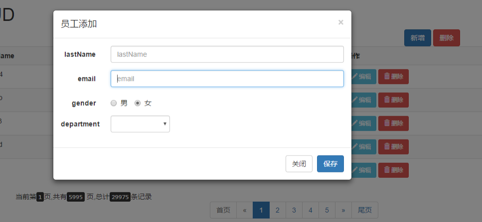
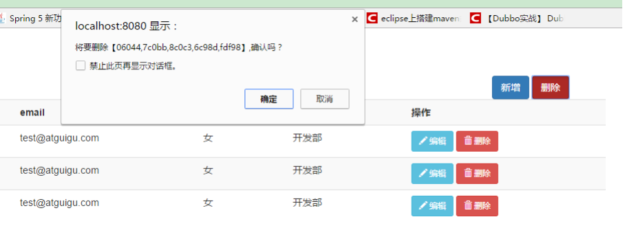
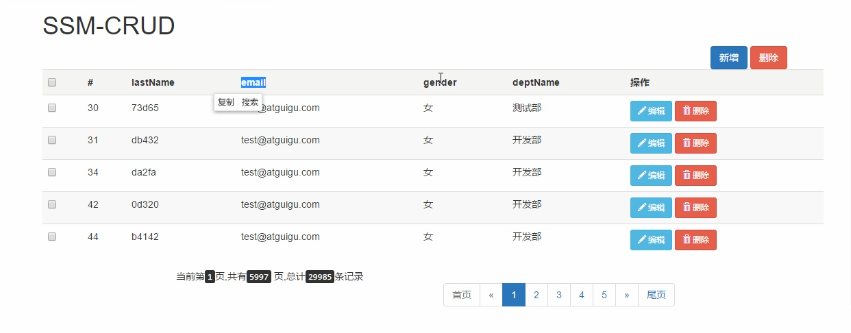
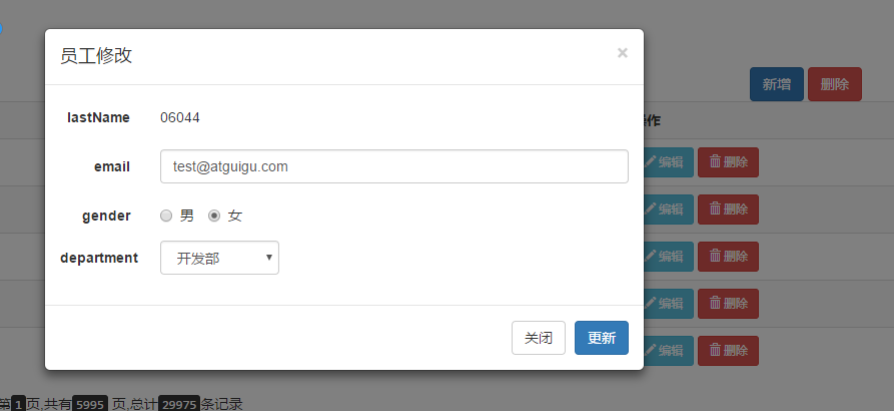

# Employee information management system

## Table of contents
- [Introduction](#introduction)
- [Technology stack](#technology-stack)
- [Functions](#functions)

### Introduction
This project is used for the management of the company's personnel, including the insertion of new employees, deletion of departing employees, modification of individual information of employees, and query of relevant employee information. The project USES Spring, SpringMVC, Mybatis, bootstrap and Ajax for the front end, and MySQL for the database, which is a relatively traditional project

### Technology stack
+ Basic Framework - `SSM (SpringMVC+Spring+MyBatis)`

+ Database - the `MySQL` database

+ The front frame - `Bootstrap` to quickly build a simple and beautiful interface

+ Dependency management for projects - `Maven`

+ Paging - `pagehelper`

+ Reverse engineering -`MyBatis Generator`

### Functions

1. The paging
2. Data validation jquery front-end validation +JSR303 back-end validation
3. ajax
4. Rest-style URIs; Verbs that use the HTTP protocol request mode to represent operations on a resource (GET, POST, PUT, DELETE)

#### create

#### delete

#### retrieve

#### update

